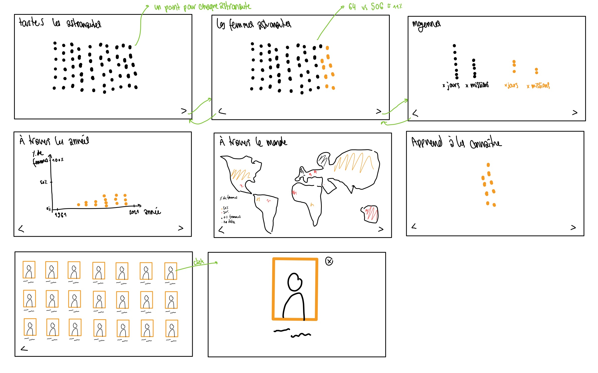

# Projet VisualDon

## Contexte

Ce sont les données de tous les astronautes, défini par "toutes les personnes qui ont voyagé à une altitude de 100 km ou plus".

Ces données ont été recueillies par le "[Aerospace Security Projet](https://aerospace.csis.org/data/international-astronaut-database/)" au CSIS (Center for Startegic & International Studies), un think tank basé à Washington D.C. aux États-Unis. Ce projet recherche le domaine de l'espace sous plusieurs aspect : la dominance spaciale, l'espace commercial et civil et la sécurité de l'espace.

## Description

Les données sont dans un format `csv`. Chaque atronaute à un nom, un pays d'origine, un genre, les vols sur lesquel ils.elles étaient, le nombre de vols sur lesquels ils.elles étaient et leur temps total dans l'espace.

## But

J'aimerais découvrir les tendances de genre, de pays d'origine, comparé au temps passé dans l'espace.

## Références

[Supercluser](https://www.supercluster.com/astronauts) est une base de donnée qui présente les différents astronautes, les vols, et autres données vennant de l'espace. Ces données ont un but informatif.

## Wireframe

